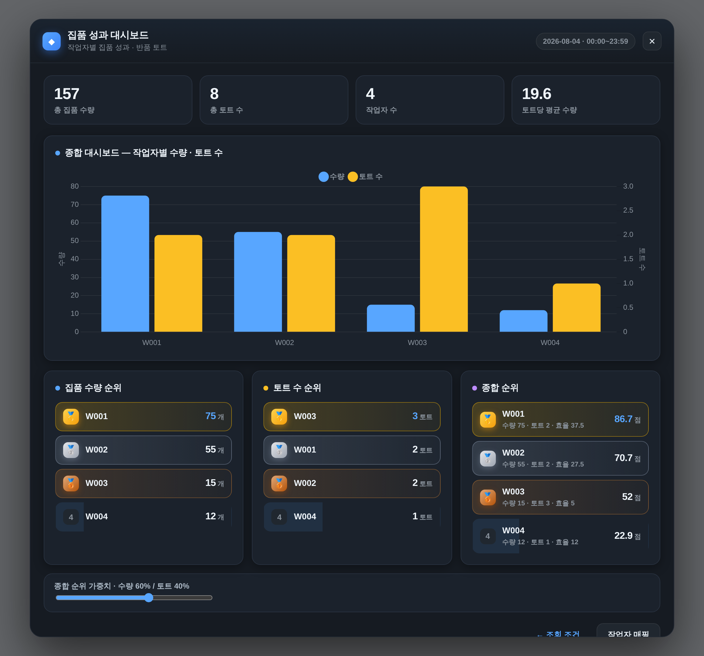

# 집품 성과 대시보드 (Picking Performance Dashboard)

`inbound.coupang.com` 반품 토트(vendor-return/tote) 데이터를 수집해 **집품 작업자별 성과**를
다크 프로 스타일 모달 + [Chart.js](https://www.chartjs.org/) 로 시각화하는 **북마크릿**입니다.

> **Chart.js 내장** — 막대 차트에 필요한 부분만 트리셰이킹한 Chart.js 를 북마크릿에 함께 담아
> 외부 CDN 을 전혀 사용하지 않습니다. 따라서 쿠팡 사이트의 CSP 와 무관하게 차트가 그려집니다.



---

## 설치

1. 브라우저 **북마크바**를 켭니다 (⌘⇧B / Ctrl+Shift+B).
2. `index.html` 을 브라우저로 열고, 파란 **집품 성과 대시보드** 버튼을 북마크바로 **드래그**합니다.
   - 드래그가 어려우면 [`dist/bookmarklet.txt`](dist/bookmarklet.txt) 내용을 복사해 새 북마크의 **주소(URL)** 로 붙여넣어도 됩니다.

> `index.html` 은 GitHub Pages 나 로컬(`file://`) 어디서 열어도 설치 링크가 동작합니다.

## 사용

1. **inbound.coupang.com 에 로그인**한 상태에서 아무 페이지나 연 뒤 북마크릿을 클릭합니다.
   (같은 출처에서 실행해야 세션 쿠키로 조회가 되고 CORS 문제가 없습니다.)
2. 모달에서 **시작/종료 날짜·시간**을 정하고 **조회**를 누릅니다.
3. 수집이 끝나면 종합 대시보드와 순위 카드가 나타납니다.
4. **작업자 매핑** 버튼으로 작업자 코드에 이름을 붙일 수 있습니다 (브라우저에 저장됨).

## 무엇을 수집하나

1. 다음 목록을 조회합니다 (날짜는 입력값으로 치환, `dateType=PICKING_CREATED`, `size=10000`):
   ```
   https://inbound.coupang.com/vendor-return/tote/paging?...&dateType=PICKING_CREATED&start=<시작>&end=<종료>&size=10000
   ```
2. 각 행 **첫 번째 `td` 의 링크**로 들어가, 상세 페이지 **첫 번째 `table`** 에서 세 값만 수집합니다.
   - `td[0]` = **토트바코드**
   - `td[6]` = **집품작업자**
   - `td[7]` = **수량**
3. 서버는 **날짜 단위**로만 조회하므로, 지정한 **시간** 범위는 목록 행의 집품생성시각을 기준으로
   클라이언트에서 추가 필터링합니다. (행에서 `YYYY-MM-DD HH:MM(:SS)?` 형태를 자동 탐지하므로
   컬럼 위치가 바뀌어도 견고합니다. 시각을 인식하지 못한 행은 손실 없이 포함하고 건수를 알려줍니다.)

## 화면 구성

- **종합 대시보드** — 작업자별 `수량`(블루)·`토트 수`(앰버) 그룹 막대그래프(이중 축) + 요약 타일
  (총수량 / 총토트 / 작업자수 / 토트당 평균 수량).
- **집품 수량 순위** · **토트 수 순위** · **종합 순위** — 3개의 **수치 순위 리스트**(리더보드).
  1·2·3등은 🥇🥈🥉 메달과 골드/실버/브론즈 하이라이트로 강조하고, 종합 순위엔 수량·토트·효율을 함께 표시합니다.

### 종합 순위 계산

수량이 적어도 **토트 수가 많으면 그만큼 노동(effort)** 이 든다는 점을 반영합니다. 할당이 운 나쁘게
넓게 퍼져 토트만 많고 수량이 적은 작업자가 불이익받지 않도록, 두 지표를 **모두 가점**으로 합산합니다.

1. 각 작업자의 `수량`과 `토트 수`를 각각 **min–max 0~100 정규화**.
2. `종합점수 = w_qty · 수량_norm + w_tote · 토트_norm` (기본 **수량 60% / 토트 40%**).
3. 모달의 **가중치 슬라이더**로 관리자가 상황에 맞게 조절합니다(합=100%). 토트 가중치를 높이면
   "넓게 퍼진 할당"을 받은 작업자가 더 보상받습니다.
4. 보조 지표로 **집품 효율(수량 ÷ 토트, 토트당 평균 수량)** 을 툴팁에 함께 표시합니다.

> 예) 토트 3개에 수량 15인 작업자는 기본 가중치에서 최하위지만, 토트 가중치를 높이면 상위로 올라옵니다.

## 작업자 매핑 (엑셀 붙여넣기)

- **작업자 매핑** 버튼 → 상단 칸에 **엑셀에서 2열(코드, 이름)을 그대로 복사해 붙여넣으면** 표에 자동 반영됩니다.
  (탭/콤마/여러 칸 공백 구분 모두 인식) 붙여넣는 즉시 반영되며, 개별 행 수정·추가도 가능합니다.
- 왼쪽 열은 수집된 코드로도 자동 채워집니다. **저장**하면 모든 차트·순위 라벨이 이름으로 표시됩니다.
- 매핑과 가중치 설정은 브라우저 `localStorage` 에 저장되어 다음 실행에도 유지됩니다.

## 개발 / 빌드

```bash
# (최초 1회 또는 Chart.js 버전 변경 시) 막대 차트용 최소 Chart.js 번들 생성
npx esbuild vendor/chart-entry.mjs --bundle --minify --format=iife --outfile=dist/chart.min.js

# dashboard.js + Chart.js 번들 → 자체포함 북마크릿(dist/bookmarklet.txt) + index.html 링크 갱신
node build.js       # 또는  npm run build
```

- `dashboard.js` — 앱 전체 로직(가독성 있는 원본). **여기만 수정**하고 `node build.js` 로 재생성합니다.
- `vendor/chart-entry.mjs` — 필요한 Chart.js 컴포넌트(막대/축/툴팁/범례)만 등록해 전역 노출하는 번들 엔트리.
- `dist/chart.min.js` — esbuild 로 트리셰이킹·압축한 최소 Chart.js 번들(북마크릿에 내장됨, 커밋됨).
- `build.js` — `dist/chart.min.js` + 최소화한 `dashboard.js` 를 이어붙여 `javascript:` URI 로 인코딩.
- `index.html` — 설치 페이지 + **모의 데이터 미리보기**(쿠팡 접속 없이 UI/차트 확인).
- `mock/` — 오프라인 검증용 샘플 목록/상세 HTML.
- `dist/bookmarklet.txt` — 생성된 자체포함 북마크릿(약 250KB, Chart.js 포함).

### 로컬 검증

`index.html` 의 **“모의 데이터로 대시보드 열기”** 를 누르고 조회하면, `mock/` fixtures 로
파싱 → 집계 → 차트까지 실제 경로를 그대로 확인할 수 있습니다.

## 참고 / 한계

- **완전 자체포함**입니다. Chart.js 까지 북마크릿에 내장되어 외부 네트워크 요청이 전혀 없으므로
  쿠팡 사이트의 CSP 와 무관하게 동작합니다(용량은 약 250KB). 그래도 무언가 막히면
  `dist/bookmarklet.txt` 내용을 **개발자도구 콘솔에 붙여넣어** 실행해 볼 수 있습니다.
- 상세 페이지 셀 인덱스(`td[0]/[6]/[7]`)는 명세 기준이며, 실제 마크업이 다르면
  `dashboard.js` 상단의 `IDX_TOTE / IDX_PICKER / IDX_QTY` 상수만 바꾸면 됩니다.
- 각 상세 = 토트 1건으로 간주합니다(토트 수 = 고유 토트바코드 수).
- 목록이 크면(최대 `size=10000`) 상세 요청이 많을 수 있어 **동시 6건**으로 제한하고 진행률을 표시합니다.
